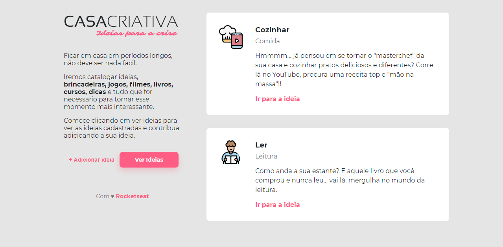
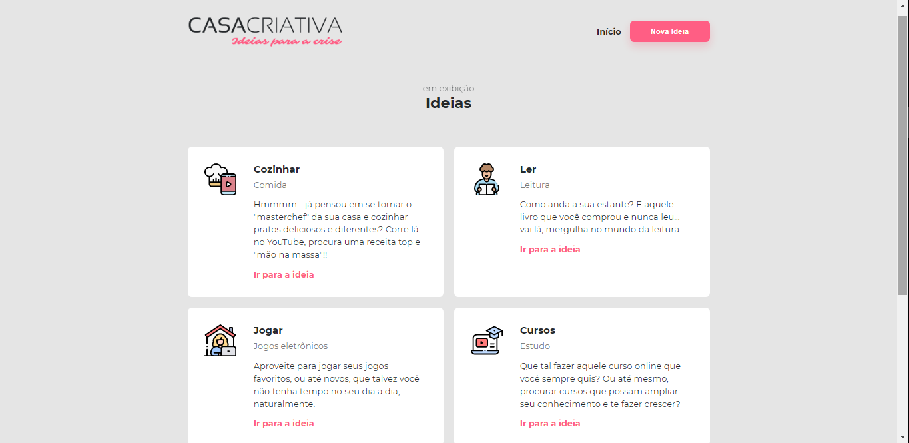
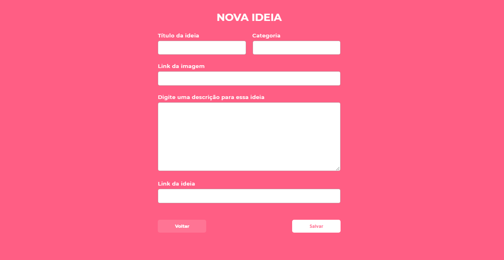

# 

 <h4> Projeto desenvolvido durante o WorkshopDev da Rocketseat, com o intutito de expor e dá oportunidade de adicionar ideias (atividades) para se fazer durante a crise (quarentena). 💜 </h4>
 
 > (Html, CSS, JS, SQL)
 
 
 
 Página inicial 

  
 
 
 Página de exibição das ideias adicionadas 

   
 
 
 Formulário para adicionar novas ideias 

   

 ## 🤖 Instalação e execução:

<li> 1. Abra o terminal do seu computador.</li>
<li> 2. Altere o diretório de trabalho atual para o local em que deseja ter o código do módulo salvo no seu computador (ex: cd c:\).</li>
<li> 3. Faça um clone desse repositório rodando:  
   git clone https://github.com/millenalcs/casa_criativa.git; </li>
<li> 4. Entre na pasta rodando pelo terminal: cd casa_criativa; </li>
<li> 5. Rode npm run dev para iniciar o servidor de desenvolvimento.</li>

:)
